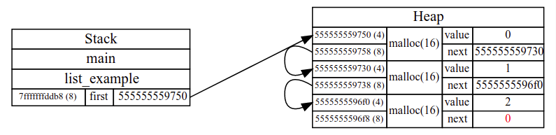

## visualize-c-memory
一款能够调试C程序,并且实时输出可视化的程序内存空间的程序.该程序运行在ubuntu20.04(或者任何支持gdb(version>7.0),python3,makefile环境的Linux系统)
使用 [vscode-debug-visualizer](https://github.com/hediet/vscode-debug-visualizer)作为编辑器和svg文件展示器
和 [GDB's Python API](https://sourceware.org/gdb/current/onlinedocs/gdb/Python-API.html)来调试C语言程序





### To try it

- 下载 graphviz.(程序生成的dot流,利用graphviz生成各式图像流,例如png,svg)
  ```
  sudo apt install graphviz
  ```

- 在vscode中安装插件,该插件仅作为内置浏览器显示json格式的图片 [vscode-debug-visualizer](https://github.com/hediet/vscode-debug-visualizer).

- Clone this repository, 在vscode中打开仓库并且 (`F5`).

  如果调试没有开始,确保 `gdb`, `make` 已经下载好了

- 按下F1后选择Debug Visualizer: New View窗口 `F1 / Debug Visualizer : New View` 再
  输入 `"memory"` (__包括__ 引号) 在新建的窗口中

- 使用如下快捷键进行单步调试,跳出,步进(`F10`, `F11`, etc).

- 修改 [`examples/examples.c`](examples/examples.c)来运行用户自己的代码

### 图片导出功能
每次调试程序会将运行过程中生成的svg文件全部按运行顺序生成图片保存在[`out`](out/)文件夹中,用户可以挑选自己需要的那些来组成自己的(__slides__)


``` shell
conda activate slides
pip install pyan3
❯ pyan *.c --uses --no-defines --colored --grouped --annotated --dot >myuse_c.dot 
dot -Tpng -Kfdp myuses.dot -o out.png  
```


